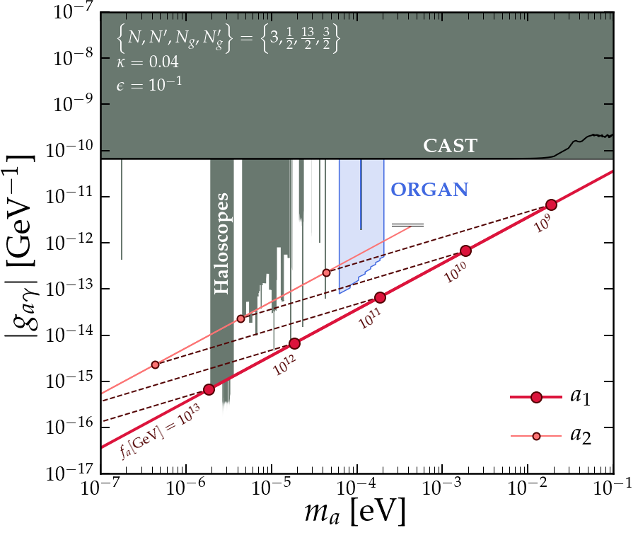

[](https://arxiv.org/abs/2109.12920)
[](https://arxiv.org/abs/2110.11014)
[](https://opensource.org/licenses/mit-license.php)

# CompAxion - Constraints on the companion axion model
Python notebooks to reproduce the plots from the papers arXiv:[2109.12920] (paper I) and arXiv:[2110.11014] (paper II)
---
[](https://github.com/cajohare/CompAxion/raw/master/plots/plots_png/Couplings.png)

# Notebooks
* [`Couplings.ipynb`](https://github.com/cajohare/CompAxion/blob/main/Couplings.ipynb) - Figure 1 of Paper I
* [`AxionMasses.ipynb`](https://github.com/cajohare/CompAxion/blob/main/AxionMasses.ipynb) - Figure 2a of Paper I
* [`Constraints.ipynb`](https://github.com/cajohare/CompAxion/blob/main/Constraints.ipynb) - Figure 2b of Paper I
* [`Projections.ipynb`](https://github.com/cajohare/CompAxion/blob/main/Projections.ipynb) - Figure 3 of Paper I
* [`Cosmology.ipynb`](https://github.com/cajohare/CompAxion/blob/main/Cosmology.ipynb) - Figure 1 of Paper II
* [`ThetaAngles.ipynb`](https://github.com/cajohare/CompAxion/blob/main/Isocurvature.ipynb) - Figure 2 of Paper II
* [`GWs.ipynb`](https://github.com/cajohare/CompAxion/blob/main/GWs.ipynb) - Figure 3 of Paper II

# Python files
* [`AxionFuncs.py`](https://github.com/cajohare/CompAxion/blob/main/AxionFuncs.py)
* [`PlotFuncs.py`](https://github.com/cajohare/CompAxion/blob/main/PlotFuncs.py)

# Other content
* [`limit_data/`](https://github.com/cajohare/CompAxion/tree/main/src) - Contains digitised limits on the axion-photon coupling, as well as gravitational wave sensitivities from [Schmitz 2020](https://arxiv.org/abs/2002.04615)
* [`plots/`](https://github.com/cajohare/CompAxion/tree/main/plots) - Contains all the plots in pdf and png formats
* [`data/`](https://github.com/cajohare/CompAxion/tree/main/data) - currently just has the Primakoff solar axion flux needed for one calculation

---

If you need any further assistance or have any questions, contact me at ciaran.aj.ohare@gmail.com. And if you do use anything here please cite the pheno paper, [Chen et al. 2021a](https://arxiv.org/abs/2109.12920)
```
@article{Chen:2021hfq,
    author = "Chen, Zhe and Kobakhidze, Archil and O'Hare, Ciaran A. J. and Picker, Zachary S. C. and Pierobon, Giovanni",
    title = "{Phenomenology of the companion-axion model: photon couplings}",
    eprint = "2109.12920",
    archivePrefix = "arXiv",
    primaryClass = "hep-ph",
    month = "9",
    year = "2021"
}
```
or for the cosmology paper [Chen et al. 2021b](https://arxiv.org/abs/2110.11014)
```
@article{Chen:2021abc,
    author = "Chen, Zhe and Kobakhidze, Archil and O'Hare, Ciaran A. J. and Picker, Zachary S. C. and Pierobon, Giovanni",
    title = "{Cosmology of the companion-axion model: dark matter, gravitational waves, and primordial black holes}",
    eprint = "2110.11014",
    archivePrefix = "arXiv",
    primaryClass = "hep-ph",
    month = "10",
    year = "2021"
}
```
